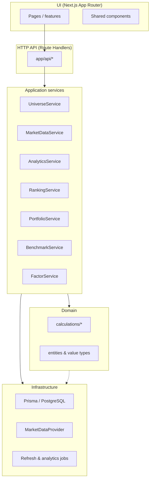

# MarketMap — System Architecture

This document describes the proposed architecture for a production-grade **equity market mapping and portfolio analytics** platform. It aligns with implementation in this repository (`src/` layout, Prisma, Next.js).

## 1. Goals and principles

| Priority | Implication |
|----------|-------------|
| **Correctness** | Trading-day definitions, adjusted-close returns, and portfolio math are implemented once in `src/domain` and covered by unit tests. |
| **Maintainability** | Strict layering: UI never contains valuation formulas; services orchestrate; repositories isolate persistence. |
| **Extensibility** | New market data vendors and factor datasets plug in via interfaces in `src/infrastructure/providers`. Stage-2 factors swap data without changing UI contracts. |
| **Reliability** | Jobs are idempotent where possible, logged, retried on transient failures, and persist job state (`RefreshJob`). |

## 2. Layered modular monolith



**Dependency rule:** `domain` has no imports from `infrastructure` or `features`. Services in `features` or `src/server` (or `lib/server`) wire domain + repositories. API route handlers stay thin: validate input → call service → map to DTO.

## 3. Directory layout (canonical)

```
src/
  app/                    # Next.js routes, layouts, Route Handlers (API)
  components/             # Reusable UI (tables, heatmap shell, legends)
  features/
    universe/             # Universe list, paste flow, CRUD
    marketdata/           # Status, manual refresh triggers
    analytics/            # Market map page, metric/row selectors
    rankings/             # Ranking table + sort state
    portfolio/            # Builder + analytics views
    factors/              # Factor exposure UI (stages 1–2)
    benchmarks/           # Comparison charts
  domain/
    entities/             # Types (no Prisma): Horizon, MetricKind, RowLevel, etc.
    services/             # Pure orchestration helpers if needed (optional)
    calculations/         # returns, vol, Sharpe, excess, portfolio stats, aggregation
  infrastructure/
    db/                   # Prisma client wrapper, repositories
    providers/            # MarketDataProvider implementations
    jobs/                 # refresh, benchmark sync, analytics recompute
    config/               # env, risk-free rate, feature flags
  api/                    # Optional: OpenAPI types or route-level validators (Zod)
tests/                    # Vitest — domain tests first
```

Analytics formulas live only under **`src/domain/calculations`**. UI reads numbers from API responses computed by services that call those functions.

## 4. Core domain concepts

### 4.1 Classification hierarchy

Only: **Sector → Sub-Theme → Company**. Market map rows and rankings are keyed by `RowLevel`: `SECTOR` | `SUB_THEME` | `COMPANY`.

Aggregation for sector and sub-theme: **mean of constituent company metrics** (same metric and horizon as selected), unless product rules later define something else (e.g. cap-weighted)—currently spec says average.

### 4.2 Horizons (trading days)

| Label | Trading days |
|-------|----------------|
| 1D | 1 |
| 5D | 5 |
| 1M | 21 |
| 3M | 63 |
| 6M | 126 |
| 1Y | 252 |

All period labels in the UI refer to **trading** windows, not calendar spans.

### 4.3 Metrics

- **Return** — from adjusted close, cumulative or compound over horizon as implemented in domain (spec: multi-period returns from daily chain).
- **Excess Return** — stock (or aggregated) return minus benchmark return for same horizon; benchmark selectable (S&P 500, NASDAQ, DOW).
- **Volatility** — annualized realized vol from daily returns over the estimation window; label in UI: **annualized realized volatility**.
- **Sharpe** — \(\text{Sharpe} = \frac{R_{ann} - r_f}{\sigma_{ann}}\) with \(R_{ann} = \text{mean(daily)} \times 252\), \(\sigma_{ann} = \text{stdev(daily)} \times \sqrt{252}\); \(r_f\) configurable; if \(\sigma_{ann}=0\), return defined result (e.g. null or capped signal) — documented in code.

### 4.4 Market map matrix

Always **six columns** (1D, 5D, 1M, 3M, 6M, 1Y). Rows depend on `RowLevel`. Heatmap coloring rules are implemented as a separate pure module (scale min/max or quantiles per view) so the UI only applies CSS from computed bins.

## 5. Market data provider abstraction

### 5.1 Interface (conceptual)

Implementations live under `src/infrastructure/providers/` and implement something equivalent to:

| Method | Purpose |
|--------|---------|
| `fetchSecurityMetadata(ticker)` | Validate symbol, name, exchange/currency if needed |
| `fetchHistoricalPrices(ticker, start, end)` | Daily series with **adjusted** close (and raw OHLCV if stored later) |
| `fetchBenchmarkSeries(benchmark, start, end)` | Series aligned to our `Benchmark` enum |
| `fetchFactorInputs(ticker)` | Stage-1 placeholders; Stage-2 richer datasets |

The application **never** calls a vendor SDK from domain or UI—only from provider adapters.

### 5.2 Recommended providers

| Use case | Recommendation | Notes |
|----------|----------------|--------|
| **Local dev / CI (no API key)** | **[Stooq](https://stooq.com/)** (CSV-style EOD) or a **Yahoo-Finance2** adapter | Fast iteration; verify licensing/ToS for your organization; good for non-production sandboxes. |
| **Production (affordable API)** | **[Tiingo](https://www.tiingo.com/)** or **[Polygon.io](https://polygon.io/)** | Tiingo: strong EOD adjusted series; Polygon: broad US coverage, intraday if needed later. |
| **Enterprise (market data policy)** | **Refinitiv / Bloomberg / FactSet** | Often required by compliance; same interfaces, different adapter. |

**Shipped default:** **`YahooFinanceMarketDataProvider`** uses Yahoo’s public **v8 chart** and **v7 quote** HTTP endpoints (no npm `yahoo-finance2` dependency—the library currently pulls Deno-only test modules that break Next.js bundling). For production licensing and stability, add a **Tiingo** or **Polygon** adapter behind the same `MarketDataProvider` interface.

## 6. API surface (evolutionary)

- REST JSON under `app/api/v1/...` (versioned when breaking changes appear).
- Input validation with **Zod** at the HTTP boundary; responses typed.

Representative groups: `/universe`, `/securities`, `/prices`, `/analytics/market-map`, `/portfolios`, `/benchmarks`, `/jobs`, `/factors`.

## 7. Background jobs

- **Market data refresh** — pull missing daily bars, backfill up to 10 years, idempotent upsert into `PriceHistory`.
- **Benchmark refresh** — same for `BenchmarkPriceHistory`.
- **Analytics recalculation** — read prices + config, write `AnalyticsSnapshot` / cells or materialized results; trigger on schedule and after universe edits (debounced).

Execution: `tsx` CLI scripts or worker process; optional **BullMQ + Redis** when horizontal scaling is needed. All jobs write `RefreshJob` rows.

## 8. Security and configuration

- **Secrets** via environment variables only.
- **Risk-free rate** (annual, decimal) from config (e.g. `RISK_FREE_ANNUAL=0.04`).
- If multi-tenant or login is added later: enforce auth on Route Handlers; never trust the client for entitlements.

## 9. Testing strategy

| Layer | Focus |
|-------|--------|
| `domain/calculations` | Returns, vol, Sharpe, edge cases, portfolio weighted return/vol (as defined) |
| Universe parser | Tab-separated paste, ticker validation |
| Integration (later) | Prisma + test DB, provider mocks |

## 10. Documentation

Methodology (Sharpe, horizons, excess return, aggregation) is duplicated in **code comments** next to the formulas and in `PROJECT_BRIEF.md` for agent alignment. User-facing copy can live in the app help panel later.

---

*This document should be updated when major structural or vendor decisions change.*
